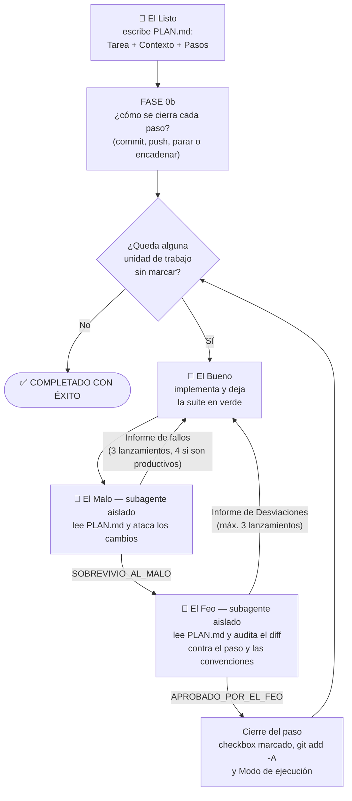

# GBU — El Bueno, el Feo y el Malo


Un patrón de orquestación multi-agente para desarrollar software con [Claude Code](https://claude.com/claude-code), inspirado en el western de Sergio Leone: un Sheriff coordina a cuatro especialistas que planifican, implementan, atacan y auditan el código, paso a paso, hasta completar la tarea.

La idea central: **separar quien escribe el código de quien lo juzga**. Quien implementa trabaja con todo el contexto; quienes verifican trabajan aislados, sin haber visto la implementación, para juzgar solo lo que hay en disco y sin el sesgo de aprobar su propio trabajo.

Este repositorio es **una implementación de ejemplo** del patrón, hecha para Claude Code. El patrón en sí no es de nadie: cualquiera puede implementarlo libremente, tal cual o a su manera, en la herramienta que prefiera.

- **Por qué existe y de dónde sale**: [«cómo poner a pelear a tres agentes para que escriban tu código por ti»](https://jafs.github.io/articles/posts/20260802.html) y [«GBU con El Listo»](https://jafs.github.io/articles/posts/20260809.html).
- **Por qué está montado así**: [`DESIGN.md`](DESIGN.md) — el flujo fase a fase y la razón detrás de cada regla.

## Los personajes

| Personaje | Rol | Cómo se ejecuta |
| --- | --- | --- |
| **El Sheriff** (`/gbu`) | Orquesta el patrón completo | Agente principal |
| 🥸 **El Listo** (`/listo`) | Convierte la tarea en un plan incremental (`PLAN.md`) | Rol adoptado por el Sheriff, solo al inicio |
| 🤠 **El Bueno** (`/bueno`) | Implementa el siguiente paso del plan y deja los tests en verde | Rol adoptado por el Sheriff, con todo el contexto |
| 🌵 **El Malo** (`/malo`) | QA adversario: intenta romper la implementación con casos hostiles | **Subagente aislado**, parte de cero |
| 👺 **El Feo** (`/feo`) | Auditor estricto: rechaza cualquier desviación de la especificación o las convenciones | **Subagente aislado**, parte de cero |

## El flujo



En corto:

- **La unidad de trabajo es el checkbox**: cada uno pasa el ciclo completo (Bueno → Malo → Feo) y cierra con su propio commit.
- **El plan viene terminado**: cada paso trae sus rutas exactas, el fichero al que debe parecerse y dónde vive su test. Y si el proyecto se contradice, El Listo se detiene y pregunta en vez de elegir por ti.
- **Las flechas de vuelta son bucles de corrección acotados**: al relanzar, el verificador solo recibe su informe anterior y el diff del arreglo, no el paso entero.
- **El staging de git marca la frontera**: lo aprobado se stagea, lo sin stagear es el paso en curso, y los verificadores solo miran eso.
- **Los topes no bloquean**: si El Malo agota sus lanzamientos, lo pendiente se entrega como observaciones y queda en `TECHNICAL_DEBT.md`; solo se detiene si lo pendiente es grave.

El detalle fase a fase está en [`DESIGN.md`](DESIGN.md).

## Instalación

Copia los dos directorios en la raíz de tu proyecto:

```text
tu-proyecto/
└── .claude/
    ├── commands/      # gbu.md, listo.md, bueno.md, feo.md, malo.md
    └── agents/        # feo.md, malo.md  (los subagentes aislados)
```

No hay nada que compilar ni configurar: son ficheros markdown que Claude Code carga automáticamente como comandos slash y subagentes.

## Uso

El modo normal es lanzar el patrón completo:

```text
/gbu implementa un endpoint REST para dar de alta usuarios con validación de email
```

- Si no existe `PLAN.md`, El Listo lo genera primero a partir de tu descripción (o de la ruta a un fichero/issue que le pases).
- Si ya existe, el Sheriff retoma directamente el primer checkbox sin marcar que no tenga subpasos debajo — puedes parar y relanzar `/gbu` cuando quieras: el plan en disco es el estado.
- Si el plan existe pero no tiene la estructura que el patrón espera (Tarea, Contexto, Pasos con checkboxes), El Listo lo normaliza primero y te pide confirmación antes de arrancar.
- `/gbu` acepta además como argumento una ruta de plan alternativa, un paso concreto por el que empezar, o «solo un paso» para ejecutar uno y parar.

Consejos:

- **Revisa `PLAN.md` antes de dejar correr el ciclo.** Es el contrato que seguirán todos los agentes; dos minutos ahí valen más que cualquier corrección posterior.
- Si tienes acuerdos de equipo (un directorio de *agreements*, guías de estilo), díselo en el prompt inicial para que El Listo los sintetice en el plan.
- Si dejas el commit en tus manos, los cambios aprobados quedan en staging: revisa y commitea con la granularidad que prefieras.
- Para cambiar de opinión a mitad de plan, edita la sección `## Modo de ejecución` de `PLAN.md`: el Sheriff la relee al cerrar cada paso.

También puedes invocar piezas sueltas:

```text
/listo <tarea>     # solo generar el plan
/bueno             # implementar el siguiente paso, sin verificación
/malo              # lanzar solo el ataque sobre los cambios actuales
/feo               # lanzar solo la auditoría sobre los cambios actuales
```

## Ejemplos

El directorio [`examples/`](examples/) contiene ejemplos reales generados con `/gbu`. Cada subdirectorio incluye el `PLAN.md` que escribió El Listo, el código y los tests que salieron del ciclo completo —incluidos los casos adversarios de El Malo— y un `README.md` con la traza de la ejecución.

| Ejemplo | Qué es | Qué ilustra |
| --- | --- | --- |
| [`examples/roman-numerals/`](examples/roman-numerals/) | Conversor de números romanos en Python (`unittest`) | El flujo completo en dos pasos; El Malo verifica el rango entero con un decodificador independiente |
| [`examples/slugify/`](examples/slugify/) | Slugify en JavaScript (`node:test`) | Las observaciones de El Malo sobre un paso guían el diseño del siguiente |
| [`examples/csv-line/`](examples/csv-line/) | Parser CSV en JavaScript (`node:test`), con El Bueno en un modelo pequeño | El bucle de corrección completo: El Malo rompe la implementación, rompe también el primer parche, y solo aprueba la corrección estructural |

Lo que dejaron estas ejecuciones más allá del código está en [`DESIGN.md`](DESIGN.md#lo-que-dejaron-los-ejemplos).

## Adáptalo a tu LLM favorito

Aquí no hay ni una línea de código: todo el patrón son prompts en markdown. Eres completamente libre de adaptarlo al LLM o herramienta que quieras — Gemini CLI, Codex, Cursor, aider, un orquestador propio... Los conceptos viajan bien:

- Los ficheros de `commands/` son prompts de sistema con un pequeño frontmatter; cualquier herramienta con comandos o plantillas de prompt los acepta casi tal cual.
- Los de `agents/` solo necesitan que tu herramienta pueda lanzar una sesión limpia e independiente (un subagente, otro proceso, otra llamada a la API) cuyo único canal de vuelta sea su respuesta final.
- Lo importante no es la sintaxis sino las reglas del juego: plan en disco como única memoria compartida, verificadores sin contexto de la implementación, tokens exactos de aprobación, informes solo de lo que falla y bucles con tope.

Si lo adaptas, mejoras o descubres que algún personaje necesita mano dura, adelante: el patrón es tuyo.
