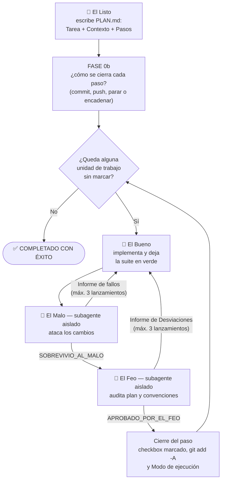

# GBU — El Bueno, el Feo y el Malo


Un patrón de orquestación multi-agente para desarrollar software con [Claude Code](https://claude.com/claude-code), inspirado en el western de Sergio Leone: un Sheriff coordina a cuatro especialistas que planifican, implementan, atacan y auditan el código, paso a paso, hasta completar la tarea.

La idea central: **separar quien escribe el código de quien lo juzga**. Quien implementa trabaja con todo el contexto; quienes verifican trabajan aislados, sin haber visto la implementación, para juzgar solo lo que hay en disco y sin el sesgo de aprobar su propio trabajo.

El origen y la motivación del patrón están contados en detalle en el artículo [«El Bueno, El Feo y El Malo: cómo poner a pelear a tres agentes para que escriban tu código por ti»](https://jafs.github.io/articles/posts/20260802.html).

Este repositorio es **una implementación de ejemplo** del patrón, hecha para Claude Code. El patrón en sí no es de nadie: cualquiera puede implementarlo libremente, tal cual o a su manera, en la herramienta que prefiera — la sección [«Adáptalo a tu LLM favorito»](#adáptalo-a-tu-llm-favorito) da las claves para portarlo.

## Los personajes

| Personaje | Rol | Cómo se ejecuta |
| --- | --- | --- |
| **El Sheriff** (`/gbu`) | Orquesta el patrón completo | Agente principal |
| 🥸 **El Listo** (`/listo`) | Convierte la tarea en un plan incremental (`PLAN.md`) | Rol adoptado por el Sheriff, solo al inicio |
| 🤠 **El Bueno** (`/bueno`) | Implementa el siguiente paso del plan y deja los tests en verde | Rol adoptado por el Sheriff, con todo el contexto |
| 🌵 **El Malo** (`/malo`) | QA adversario: intenta romper la implementación con casos hostiles | **Subagente aislado**, parte de cero |
| 👺 **El Feo** (`/feo`) | Auditor estricto: rechaza cualquier desviación de la especificación o las convenciones | **Subagente aislado**, parte de cero |

## El flujo



Las flechas de vuelta a El Bueno son los bucles de corrección: cada relanzamiento del verificador es una **verificación acotada** —solo el informe anterior y el diff del arreglo—, no una pasada nueva. El detalle, fase a fase:

```text
FASE 0 (una sola vez)
  El Listo analiza el proyecto y los acuerdos del equipo
  y escribe PLAN.md: Tarea + Contexto + Pasos con checkboxes
  (los pasos grandes van partidos en subpasos indentados)

FASE 0b (una sola vez)
  El Sheriff te pregunta cómo quieres cerrar cada paso: ¿commit y
  push automáticos?, ¿con qué formato de mensaje?, ¿el plan entero
  de una tirada o parando al terminar cada paso? Lo anota en
  PLAN.md y no vuelve a preguntar.

Por cada unidad de trabajo pendiente (paso o subpaso):

  FASE 1 — El Bueno implementa el paso y deja la suite de tests en verde
     │
     │  (atajo: el Sheriff clasifica el diff —comentarios, tests,
     │   formateo automático, recursos estéticos— y de esa clase
     │   salen qué verificadores ejecuta y qué fases entran)
     │
  FASE 2 — El Malo (subagente) ataca los cambios: nulls, límites,
     │     datos corruptos, concurrencia... Sus tests quedan en la
     │     suite como regresión.
     │       ├─ SOBREVIVIO_AL_MALO → continúa
     │       └─ Informe de fallos → El Bueno corrige todo de una
     │          pasada y El Malo verifica (máx. 3 lanzamientos;
     │          lo que quede tras el tope se te entrega como
     │          observaciones y el paso sigue)
     │
  FASE 3 — El Feo (subagente) audita contra el plan y las convenciones
     │       ├─ APROBADO_POR_EL_FEO → continúa
     │       └─ Informe de Desviaciones → El Bueno corrige y El Feo
     │          verifica (máx. 3 lanzamientos). Si alguna desviación
     │          era funcional, El Malo da una última pasada acotada.
     │
  Fin del paso — checkbox marcado en PLAN.md (y el del paso padre
                 si era su último subpaso), cambios a staging
                 y lo que diga el Modo de ejecución: commit y push,
                 solo commit, o nada. Si pediste parar entre pasos,
                 el Sheriff se detiene al cerrar el paso —no entre
                 subpasos— y espera, para que puedas hacer /clear
                 o darle indicaciones antes de seguir.

Cuando no quedan pasos: COMPLETADO CON ÉXITO
```

Si El Feo rechaza el trabajo tres veces seguidas, o un paso del plan ya no encaja con la realidad del código, el Sheriff se detiene y te pide ayuda en lugar de insistir a ciegas. El Malo no bloquea indefinidamente: si agota sus lanzamientos, lo pendiente se te entrega como observaciones, queda anotado en `TECHNICAL_DEBT.md` y el paso continúa.

## Decisiones de diseño

- **`PLAN.md` es el único artefacto compartido.** El Listo es el único que lee la documentación del proyecto (`CLAUDE.md`, README, acuerdos de equipo): sintetiza todo lo relevante en la sección "Contexto" del plan, y el resto de agentes trabajan exclusivamente con el plan y el código en disco. Menos relecturas, menos tokens, arranques en frío baratos.
- **Malo antes que Feo.** Primero se estabiliza el comportamiento, después se pule la forma. Así los arreglos de estilo del bucle con El Feo no obligan a re-atacar: los tests adversarios de El Malo ya montan guardia en la suite, que El Bueno debe mantener en verde tras cada ajuste.
- **El staging de git marca la frontera entre pasos.** Lo aprobado se stagea; lo que está sin stagear es el paso en curso. Los verificadores solo miran lo sin stagear, así que nunca re-auditan trabajo ya validado. En mitad de un paso nunca se commitea.
- **La historia del repositorio es tuya, pero puedes delegarla.** Por defecto el patrón no hace commits. Si al arrancar le dices que sí, cada paso aprobado se cierra con un commit —y un push si lo pides— usando el formato de mensaje que elijas. La respuesta vive en `## Modo de ejecución` dentro de `PLAN.md`, así que sobrevive entre sesiones y solo se pregunta una vez.
- **Tú decides el ritmo.** Al arrancar el plan el Sheriff también te pregunta si quieres el plan entero de una tirada o que se detenga al terminar cada paso. Parar te devuelve el control en el momento natural para hacer `/clear` —la sesión se alarga tras varios ciclos de Malo y Feo— o para dar indicaciones. Ojo a la granularidad, que no es la misma que la del commit: **el commit va por unidad de trabajo y la parada por paso**, así que un paso con tres subpasos produce tres commits (y tres push, si los pediste) y una sola parada, al caer el tercero. Como el resto del Modo de ejecución, admite respuesta libre: agrupar los commits por paso, parar cada N pasos, parar solo en los que toquen cierta zona, o parar también entre subpasos.
- **El checkbox es la unidad de trabajo.** Cada checkbox recibe su propio ciclo completo —Bueno, Malo, Feo— y su propio commit. Por eso El Listo parte los pasos que abarcan varias unidades de comportamiento o varias capas en subpasos indentados (lógica pura → infraestructura → enlace), cada uno commiteable por sí solo y con la suite en verde; el checkbox del paso queda como *roll-up*. Un checkbox demasiado ancho produce commits difíciles de seguir, obliga a los verificadores a cubrir demasiada superficie de una sentada y mezcla las correcciones con trabajo ya aprobado. Los pasos que ya son pequeños no se parten.
- **Informes agregados, verificaciones acotadas.** Malo y Feo completan su pasada entera y entregan todos los hallazgos de una vez (una corrección por iteración, no una por fallo). Cuando vuelven a entrar, solo verifican el informe anterior y lo tocado por la corrección: el Sheriff les pasa un diff que contiene **solo el arreglo** —congelando el estado previo en staging antes de corregir— y re-mide el presupuesto sobre él, no sobre el paso entero.
- **Salida disciplinada.** Los verificadores no narran su proceso ni enumeran lo que está bien: responden con el token exacto de aprobación o con el informe de lo que falla. Nada más.
- **Modelos por rol.** El Feo corre en un modelo más rápido (`model: sonnet` en su frontmatter) porque su trabajo es contrastar contra una checklist. El Malo hereda el modelo de la sesión: diseñar buenos ataques es la parte difícil, y por eso el Sheriff te avisa antes de lanzarlo si la sesión corre con un modelo pequeño — un `SOBREVIVIO_AL_MALO` de un modelo flojo vale menos. Ajusta ambos a tu gusto.
- **Presupuesto de esfuerzo.** El Sheriff mide cada paso en líneas de producción cambiadas y se lo dice a cada verificador en el encargo: un cambio de diez líneas recibe un barrido certero; uno que toca contratos o modelo de datos, barra libre. Un rol sin límites escala su esfuerzo a su propia ambición, no a la del cambio.
- **Fallo u observación.** El Malo solo bloquea lo alcanzable con datos que el sistema produce de verdad; lo que exige forzar mocks, cambiar contratos fuera del paso o cuesta más que el riesgo real se entrega como observación al cerrar el paso. Tú decides si se corrige.
- **La deuda técnica queda escrita.** Lo que El Malo encontró y no se corrigió —fallos degradados al agotar sus lanzamientos, observaciones que piden una decisión— no puede vivir solo en la conversación, que se pierde. El Sheriff lo anota en `TECHNICAL_DEBT.md`, junto al plan: cada entrada con su reproducción, su test omitido (skip) que la reproduce y qué haría falta para saldarla. Reactivar el test es retomar la deuda.
- **El Feo lee, no ejecuta.** Sus herramientas son de solo lectura: el diff y los resultados de test, lint, build y tipos le llegan ya ejecutados en el encargo. Audita si el código cumple la especificación leyendo; que funciona ya lo demostraron los tests y El Malo.
- **Atajos para pasos triviales.** Antes de verificar nada, el Sheriff clasifica el diff del paso, y esa clase decide dos cosas: **qué verificadores se ejecutan** y **qué fases entran**. Un paso de solo documentación no ejecuta ninguno —no toca nada que `test`, `lint` o `build` puedan medir, y ejecutarlos cuesta minutos para producir números que nadie va a usar—; uno de solo formateo automático ejecuta `lint`; uno de solo tests, la suite. En cuanto a fases: El Malo no ataca comentarios y El Feo no audita la salida de un formateador, pero los tests nuevos sí pasan siempre por El Feo (un assert aflojado es una desviación). La clase es la del cambio **más exigente** del diff: si toca `PLAN.md` junto a código, manda el código. Lo que el atajo ahorra es *reejecutar*, nunca el estado verde: la suite debe estarlo igual, y ante la duda se ejecuta el flujo completo.
- **El Malo escribe tests, no producción.** El Sheriff guarda una instantánea del diff de producción antes de lanzarlo y la compara al terminar: cualquier cambio de producción aparecido durante el ataque se revisa antes de seguir, porque El Feo audita justo después y no distingue la mano de El Malo de la de El Bueno.
- **Los topes se gastan en veredictos.** Si un verificador responde algo que no es ni su token de aprobación ni su informe (por ejemplo, le faltaba un dato del encargo), se completa el encargo y se relanza sin consumir el tope de tres lanzamientos: los topes miden rechazos del código, no defectos del encargo.

## Instalación

Copia los dos directorios en la raíz de tu proyecto:

```text
tu-proyecto/
└── .claude/
    ├── commands/      # gbu.md, listo.md, bueno.md, feo.md, malo.md
    └── agents/        # feo.md, malo.md  (los subagentes aislados)
```

No hay nada que compilar ni configurar: son ficheros markdown que Claude Code carga automáticamente como comandos slash y subagentes.

## Uso

El modo normal es lanzar el patrón completo:

```text
/gbu implementa un endpoint REST para dar de alta usuarios con validación de email
```

- Si no existe `PLAN.md`, El Listo lo genera primero a partir de tu descripción (o de la ruta a un fichero/issue que le pases).
- Si ya existe, el Sheriff retoma directamente el primer checkbox sin marcar que no tenga subpasos debajo — puedes parar y relanzar `/gbu` cuando quieras: el plan en disco es el estado.
- Si el plan existe pero no tiene la estructura que el patrón espera (Tarea, Contexto, Pasos con checkboxes) — por ejemplo porque lo escribiste a mano —, El Listo lo normaliza primero y te pide confirmación antes de arrancar.
- Además de la tarea, `/gbu` acepta como argumento una ruta de plan alternativa, un paso concreto por el que empezar, o «solo un paso» para ejecutar un único paso y parar.

Consejos:

- **Revisa `PLAN.md` antes de dejar correr el ciclo.** Es el contrato que seguirán todos los agentes; dos minutos ahí valen más que cualquier corrección posterior.
- Si tienes acuerdos de equipo (un directorio de *agreements*, guías de estilo), díselo en el prompt inicial para que El Listo los sintetice en el plan.
- Si dejas el commit en tus manos, los cambios aprobados quedan en staging: revisa y commitea con la granularidad que prefieras.
- Para cambiar de opinión a mitad de plan, edita la sección `## Modo de ejecución` de `PLAN.md`: el Sheriff la relee al cerrar cada paso.

También puedes invocar piezas sueltas:

```text
/listo <tarea>     # solo generar el plan
/bueno             # implementar el siguiente paso, sin verificación
/malo              # lanzar solo el ataque sobre los cambios actuales
/feo               # lanzar solo la auditoría sobre los cambios actuales
```

## Ejemplos

El directorio [`examples/`](examples/) contiene ejemplos reales generados con `/gbu`. Cada subdirectorio incluye el `PLAN.md` que escribió El Listo (con sus checkboxes ya marcados), el código y los tests que salieron del ciclo completo —incluidos los casos adversarios que El Malo dejó como regresión en la suite— y un `README.md` con la traza de la ejecución: qué planificó El Listo, qué implementó El Bueno y qué encontró u observó cada verificador en cada lanzamiento.

| Ejemplo | Qué es | Qué ilustra |
| --- | --- | --- |
| [`examples/roman-numerals/`](examples/roman-numerals/) | Conversor de números romanos en Python (`unittest`) | El flujo completo en dos pasos; El Malo verifica el rango entero con un decodificador independiente y deja casos Unicode como regresión |
| [`examples/slugify/`](examples/slugify/) | Slugify en JavaScript (`node:test`) | Las observaciones de El Malo sobre un paso guían el diseño del siguiente (el orden de la normalización Unicode) |
| [`examples/csv-line/`](examples/csv-line/) | Parser CSV en JavaScript (`node:test`), con El Bueno en un modelo pequeño | El bucle de corrección completo: El Malo rompe la implementación, rompe también el primer parche, y solo aprueba la corrección estructural; lo no corregido queda en `TECHNICAL_DEBT.md` |

### Conclusiones tras las ejecuciones

Lo que dejaron estas tres ejecuciones, más allá del código:

- **El plan es una red de seguridad.** Para provocar el bucle de corrección en `csv-line` hubo que degradar a El Bueno a un modelo pequeño *y aun así* sobrevivió a dos de los tres pasos: con un plan detallado de El Listo delante (contrato exacto, supuestos documentados, casos límite enumerados), hasta un implementador modesto acierta. El fallo apareció justo donde el diseño invitaba a duplicar estado — un problema de modelo, no de descuido.
- **El Malo aporta aunque no rompa.** En las ejecuciones sin fallos su huella quedó igualmente: casos adversarios montando guardia en la suite (`"XIV\n"`, entrada NFD, coerciones de tipo), observaciones que guiaron el diseño del paso siguiente (el orden de la normalización Unicode en `slugify` salió de su ataque al paso anterior) y deuda anotada para decidir después.
- **Sus diagnósticos de causa raíz valen tanto como sus fallos.** En `csv-line` advirtió dos veces que «el problema es del modelo, no del parche», y acertó las dos: el primer arreglo cambió un fallo por su espejo y solo la corrección estructural cerró el ciclo. Cuando El Malo señala la causa raíz, corregir el síntoma sale caro.
- **Malo antes que Feo funciona.** El Feo aprobó a la primera en todos los pasos: llegó siempre con el comportamiento ya estabilizado y los tests adversarios en verde, y pudo limitarse a contrastar contra la especificación. En proyectos con convenciones propias (arquitectura, acuerdos de equipo) su listón tiene más donde morder que en ejemplos autocontenidos como estos.
- **La asimetría de modelos es una palanca.** Bueno pequeño + Malo grande maximiza la caza (y abarata la implementación); Bueno grande + Malo grande maximiza que el paso sobreviva a la primera. Elegir modelo por rol es parte del ajuste del patrón, no un detalle de infraestructura.

## Adáptalo a tu LLM favorito

Aquí no hay ni una línea de código: todo el patrón son prompts en markdown. Eres completamente libre de adaptarlo al LLM o herramienta que quieras — Gemini CLI, Codex, Cursor, aider, un orquestador propio... Los conceptos viajan bien:

- Los ficheros de `commands/` son prompts de sistema con un pequeño frontmatter; cualquier herramienta con comandos o plantillas de prompt los acepta casi tal cual.
- Los de `agents/` solo necesitan que tu herramienta pueda lanzar una sesión limpia e independiente (un subagente, otro proceso, otra llamada a la API) cuyo único canal de vuelta sea su respuesta final.
- Lo importante no es la sintaxis sino las reglas del juego: plan en disco como única memoria compartida, verificadores sin contexto de la implementación, tokens exactos de aprobación, informes solo de lo que falla y bucles con tope.

Si lo adaptas, mejoras o descubres que algún personaje necesita mano dura, adelante: el patrón es tuyo.
